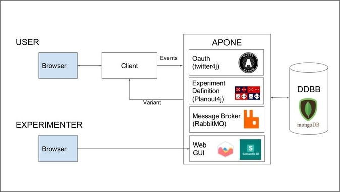

# Academic Platform for ONline Experiments

Open source platform to set up **controlled A/B experiments on the Web** 

## What

A/B testing has become the norm within Web portals to decide what changes should be implemented and which ones discarded. Online users are exposed to two or more different variants (usually changes in interfaces) and according to their behaviour, the best approach is selected.

A/B testing is also used in the academic world to test with real users if the developed approach (usually an algorithm) is better than the state-of-the art approach, or to measure the impact that the changes in specific features have in the users: 
<table><tbody>
  <tr><td align="center">
    
Would users make longer queries if we offer them longer search boxes?

    
Would the abandon rate in online courses be reduced if we increment the number of tests?

Do the films my algorithm recommends receive more clicks than the films recommended by the state-of-the-art algorithm?

    
Do people get scared, leave and never return if we add sound to our webpage?

</td></tr>
</tbody></table>

## Why

You may have already created two clients, one per variant, or two versions of the same client. Each user should be exposed to one of them and you will have to save the interactions (events) to later analyze them and decide which variant is better. You know what metrics you want to measure and how many exposures you will approximately need in your experiment (or not). But besides all that, you will also have to solve several technical problems. Some of them are outlined here:

- How can I define/start/stop an experiment?
- How can I make sure that the users are randomly assigned to the variants? How can I make sure that each user always receives the same variant?
- How can I change the percentage of users receiving each variant?
- How can I make the experiment stop after a specific number of exposures (or after a deadline)?
- How can I know what is going on with my experiment in terms of users, events, etc.?
- I want to analyze the impact if I change the caption, its color and the logo at the same time, with three different options each (3³ possible combinations). How can I do it easily?
- I am afraid users may interfere with the experiment conditions if they have access to the code from their browser, so I implemented a server-side solution. Should I develop a different solution if I develop a new client with a different programming language? 
- I want to register different types of information from the interactions (events): numbers, text, relational information, binary files, etc. How can I do this, so later I can easily analyze all that information?
- How can I avoid unexpected delays that can affect negatively the user experience if I want to save all that information in a database?

APONE offers a solution to all those problems so the experimenter can focus on the experiment design. The experimenter defines the experiments in the platform through a web GUI, and makes RESTful calls from the client/s to assign a variant to a user or to 
register information about the interaction. The experimenter just has to develop and deploy the client, include in it calls to APONE to register events, and define and start an experiment in the platform to make it work:

  

 

## Usage Scenarios

### Alice

Alice, an Information Retrieval researcher, wants to investigate whether personalized query suggestions lead to more clicks than non-personalized suggestions. She develops three variants, deploys them on three server instances and starts an APONE experiment: each variant is assigned a URL. The users all receive the same APONE endpoint and are automatically assigned and redirected to the different variants depending on the experimental conditions (e.g. the user ID saved in cookies). The clicks on a personalized suggestion are registered from the variants. Alice can check in real-time APONE’s dashboard for the progress of her experiments, including the number of exposures and the registered events per exposure. Once ended, she proceeds to filter and download the information saved to analyze it. 

   

 

### Bob

Bob has designed three different search boxes for the site search of his university. Design A is the most radical and thus Bob wants just 10% of the university website visitors to receive it, designs B and C should receive an equal fraction of all visitors. He hypothesizes that design A will lead to longer queries. Query length is thus the information to register. He creates a corresponding experiment on APONE where each variant has a variable and a value associated (eg. query-length = 20). For every visitor of the university website, an AJAX call requests the platform (using their session ID as key) for the corresponding variant. The search box with the received query length is displayed and the lengths of the issued queries are registered in the platform, also with an AJAX request. After 5,000 exposures in total the experiment is complete and the standard design is automatically returned to the visitors. 

 

### Charlie

Charlie runs a similar experiment to Bob's for his own website but he thinks that the caption, length and color of the search box may have different impacts on the query length. He defines a multivariate experiment to automatically expose his website users to all the possible combinations. He assigns a script to the experiment where the three variables are assigned different values. For every visitor of his website, it request the variant to the platform, which will include the combination of values of those variables. In this case the requests to APONE and changes to the search box are made from the server to avoid malicious users modifying the experimental conditions. 

 

### Dave's course

Dave teaches a graduate course where students have to reproduce A/B experiments. The students deploy their clients in different public servers and associate the URL where they are hosted to the experiments defined in APONE. Each student accesses the platform to participate in each other's experiment: by clicking a button, they are assigned randomly to a running experiment. APONE ensures that no user can access several variants of the same experiment or participate multiple times in it once they complete it (the experimenter decides when an experiment is completed by sending a signal to the platform). Dave can check the status of all the experiment as well as the most active users in a leaderboard.

 

## Arquitecture

APONE builds upon [PlanOut](https://facebook.github.io/planout/) to define experiments, and offers RESTful endpoints and a web GUI to easily create, manage and monitor them. Therefore the platform is completely independent of the programming language of the client or the domain of the experiments you want to run.

 

APONE delegates authentication to Twitter’s OAuth, and makes use of RabbitMQ as message broker to digest events sent by clients. The events are then stored in a MongoDB backend. All experiments and collected events can be managed and monitored in real-time through a Web interface implemented in JavaScript.

## How
A [user guide](docs/APONEUserGuide.md) explains how to easily define, run and control an experiment using a demo Client ([Client Example, or ClientE](https://marrerom.github.io/ClientE/)) and the [running instace of APONE we provide](http://ireplatform.ewi.tudelft.nl:8080/APONE), where you can also find three running experiments with ClientE for demonstration purposes. ClientE and most examples in the user guide are focused on the Information Retrieval domain. 

It is also possible to download and install the platform following the [installation instructions](docs/installation.md).

## Current Features

- Unlimited concurrent experiments
- Start/stop/restart experiments 
- Unlimited number of variants
- Percentage of experimental units per variant
- Definition of complex experiments by using [PlanOut definition language](https://facebook.github.io/planout/docs/planout-language.html)
- Possibility to override variable-values during the experiment
- Automatic stopping conditions
- Multivariate experiments
- Automatic set-up of full-factorial experiments
- Dashboard to monitor experiments in real-time
- Participation of users of the platform in the running experiments (crowd-workers)
- Leaderboard of crowd-workers who have completed more experiments
- Different formats to register interaction information (events): String, JSON, Binary
- Download events in CSV and JSON
- Message broker (RabbitMQ) to deal with events
- Assignment methods: client-side, server-side, traffic-splitting
- RESTful web services
- Web GUI to manage experiments and events

## Future Features
- (Statistical) analysis of events from within the platform

 
[Photo](https://www.flickr.com/photos/26126239@N02/14381457066/) by tvol / [CC BY](https://creativecommons.org/licenses/by/2.0/)
