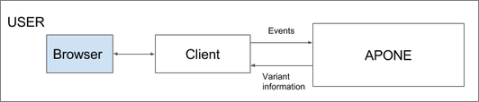
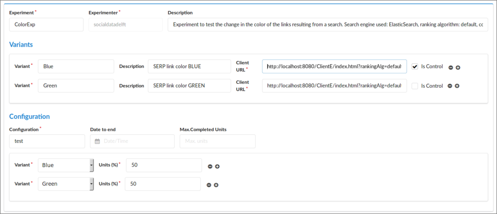
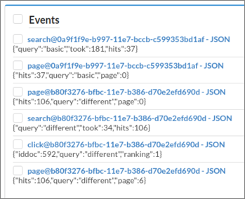
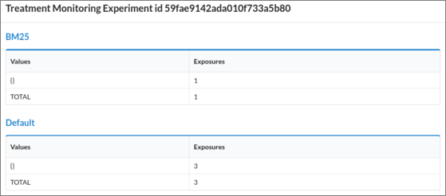
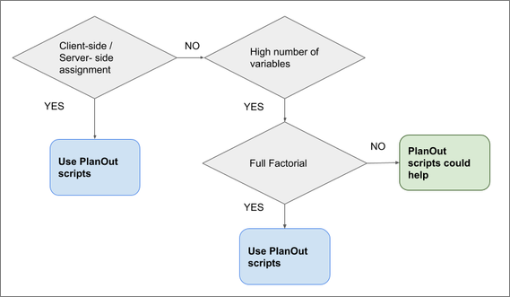

# Academic Platform for ONline Experiments (APONE)
## USER GUIDE
### TU Delft, February 2018

***
## INDEX
***

<a href="#section1">1. APONE OVERVIEW</a>

<a href="#section2">2. INFORMATION RETRIEVAL AND A/B EXPERIMENTS</a>

<a href="#section3">3. TECHNICAL DETAILS</a>

<a href="#section4">4. HOW TO SET UP AN EXPERIMENT</a>

<a href="#section5">5. HOW TO REGISTER EVENTS</a>

<a href="#section6">6. WEB INTERFACE USER REFERENCE</a>

<a href="#section7">7. ADVANCED EXPERIMENTS</a>

<a href="#section8">8. RELEVANT REFERENCES</a>


***
## <a id="section1">1. APONE OVERVIEW</a>
***
The *Academic Platform for ONline Experiments* (*APONE*, or just *platform*) aims at the evaluation of new approaches in interfaces and algorithms by means of the online interaction of users. These new approaches *treatments*) could affect the user interfaces as well as the back-end algorithms or a combination of both, and the user interactions could be compared with those obtained from existing approaches (*control*).

The objective of the platform is to setup controlled A/B experiments on the Web, as well as to keep a shared resource of methods and data that can help in research. APONE builds upon [PlanOut](https://facebook.github.io/planout) to define experiments, and offers a web GUI to easily create, manage and monitor them.

A second component is the client, accessed by the users (directly or via redirection through the experimental platform) and developed by the experimenter, which will interact with the RESTful web services of the platform directly to i) get the variant (treatment or control) corresponding to the user, and ii) register the events that occur during the user interaction. The analysis of this information will allow the experimenter later decide which treatment is best.

In order to show the capabilities of the platform as well as to ease the development of such a client, we provide a [running instance of APONE](http://ireplatform.ewi.tudelft.nl:8080/APONE) as well as an example of a client ([*ClientE*](https://marrerom.github.io/ClientE)). Currently there are three demo experiments created by a user ANONYMOUS which are connected to instances of ClientE running in the same server.

APONE is not restricted to any specific domain of research. The domain of the experiments defined and run is actually given by the client linked to it, which determines the experience of the user. Nonetheless, the provided ClientE and most examples in this user guide are limited to the Information Retrieval domain.

The purpose of this guide is to explain how to define, run and control an experiment. We assume that the experimenter has online access to APONE. It is also possible to download and install the platform following the [installation guide](docs/installation.md).

***
## <a id="section2">2. INFORMATION RETRIEVAL AND A/B EXPERIMENTS</a>
***

In this section we will introduce very briefly how Information Retrieval systems are evaluated, and we will compare the process followed in traditional evaluation with the one followed in A/B experiments.

Information Retrieval has been traditionally evaluated through **offline evaluation**, following the so called **Cranfield Paradigm**, because of the Cranfield projects initiated in 1957 by Cleverdon, which provided the foundations for the evaluation of IR systems. This paradigm consists on evaluating the results of the systems against a) a document collection, b) a predefined set of information needs or topics, c) the relevance judgements of the documents in the document collection in relation to the queries, and d) measures to compare the results (ranking and relevance of documents) obtained by the systems for the set of queries.

This approach provides a way to evaluate with reliable judgments, collected from experts or using crowdsourcing techniques, but it has two major disadvantages: the cost to obtain such judgments, and the lack of a user model that may interfere in the results obtained (eg. interaction, personalized results, impact of interface changes).

In order to include the user in the evaluation, two approaches have been used: **interactive evaluation** in controlled environments, and **online evaluation**. In the first case, a group of users interact with the systems in a controlled environment. In the second approach, users are **exposed** to the systems with no idea that an experiment is running.

All of them are controlled experiments, and they aim to test one or more hypotheses. In offline experiments the aim is to test if the results obtained by the systems are good enough to decide if one system is better than another. In the case of interactive and online experiments,  the aim is to test if the changes in user behaviour have been caused by changes to the IR system (be them in the back-end or the front-end). In both cases though, we try to statistically prove that one system is better than other, and the dependent variable that measure the effect of the changes is known as **Overall Evaluation Criteria (OEC)**.

**A/B testing** is one specific type of online experiment where users are confronted with two approaches, usually a new approach (**treatment**), and an existing approach (**control**). Each user is typically exposed to one of the **variants** (treatment or control), and his behaviour is recorded in order to decide which one has been more successful. The **experimenter** has to define and implement the metrics to measure user behaviour (eg. clicks, dwell-time, time to click, number of queries), decide how to aggregate them in an OEC to test the hypothesis, and estimate the  required sample size, conditioned by the OCE. Therefore, the experimental design should be planned together with the methodology for data analysis.

It is also relevant to note that the entity which is assigned to a treatment or a control is called the **experimental unit**. It determines the granularity at which the experimental conditions are compared (eg. the clicks, the number of queries). Although the experimental unit is typically the user, depending on the experiment we could have smaller units (eg. queries, user-day) or larger (eg. network of users). In general, we will assume that the experimental unit is the user in the examples contained in this document unless otherwise stated. 

It is also important to note that the assignment of variants to the experimental unit has to be **random** in order to guarantee the validity of the experiment, and the same experimental unit is always assigned to the same variant (usually it is desirable that the same user always interacts with the same variant during the experiment, specially if changes in the interface are involved).

Let’s see an example. Suppose we are working on a new ranking algorithm B for our search engine, and we want to test if it is actually better than the state-of-the-art ranking algorithm A. We can follow different evaluation methods:

**Traditional offline evaluation:**

1. Get data: get a test collection, that is, a collection of documents, queries, and judgments of relevance over these documents for those queries. The latter information is typically a tuple of three values: query\_id, document\_id, and relevance\_document\_query. The [Cranfield Collection](http://ir.dcs.gla.ac.uk/resources/test_collections/cran) is an example of such a test collection. More examples can be found in [Text REtrieval Conference (TREC)](http://trec.nist.gov/data/test_coll.html).
2. Index documents and run queries: index the collection of documents in your system, launch the queries and save the ranking of documents obtained by systems A and B (these are called *runs*). Typically the results are saved as tuples of four values: system\_id, query\_id, document\_id, and relevance\_document\_query.
3. Select an Overall Evaluation Criteria: select a specific OEC to compare results, for example, mean reciprocal rank (mean of the inverse of the rank of the first relevant document obtained for each query).
4. Analyse results: calculate the results of both systems for the OEC selected in relation to the relevance judgments we have. For example, we could see that system A obtains a mean of 1/3 (on average, the first relevant document is in the third position), meanwhile system B obtains a mean of 1/2 (on average, the first relevant document is in the second position)<sup><a href="#ftnt1" id="ftnt_ref1">[1]</a></sup>. As a conclusion, and in relation to the test collection and metric used, system B improves system A.

**Online A/B testing:**

1. Get Data: get a collection of documents.
2. Index documents: Index the collection of documents in the search engine.
3. Develop a client: implement a client that let the users make queries. Identify the experimental unit and implement a random algorithm to assign algorithm A or B to each unit. In this case, the experimental unit would typically be the user, so the client must identify the user and assign algorithm A or B in her searches. Provide means to automatically register the behaviour of the user that can be used to calculate the Overall Evaluation Criteria selected.
4. Select an Overall Evaluation Criteria: what are the interactions of the user that could indicate that one ranking algorithm is better than the other? Several metrics could be used, for example the click-rank (average positions of documents clicked on the search results page), where the most common variant is the mean reciprocal rank (average of the position of the first document clicked<sup><a href="#ftnt2" id="ftnt_ref2">[2]</a></sup>).
5. Analyse results:  after running the experiment and saving the results, we calculate the OEC for the group of users exposed to A, and for the group of users exposed to B, and compare the mean reciprocal rank obtained as we explained in offline evaluation.

APONE reduces the time needed to setup an A/B experiment by reducing the work to develop a client (step 3 above). For example, if the experimental unit is the user, the experimenter just has to determine what are the web pages displayed for control and treatment. In the previous example, we could develop a web page that will be displayed when the user is assigned to the control (ranking A), and a different one that will be displayed when he is assigned to the treatment (ranking B). The platform will redirect each user (according to his unique identifier) to the appropriate URL. The platform guarantees that the assignment of users to variants is random. It also offers the means to monitor and control the running experiments, and endpoints to save and retrieve the information we will have to analyze in step 5.

Finally, we should make sure that the results obtained are statistically significant. We could compare both algorithms with only three users in A/B testing, or only three queries in offline evaluation, but would those results be reliable? In the case of online experiments, the monitoring of the OEC during the experiment could help the experimenter decide when to stop.

It is also recommended to take into consideration possible external elements that may condition the behaviour of the user. For example, we could pay attention to the date and/or to the user-agent information saved in the event. Sometimes the behaviour (or even the users themselves) are different during weekdays than in the weekends. The use of a mobile device or a different browser may also change completely their behaviour. Also the first time a user access the experiment may have a behaviour completely different (novelty effect); for example, a bad search engine may receive more queries than a good one at first because the users do not find what they are looking for!


***
## <a id="section3">3. TECHNICAL DETAILS</a>
***

<p align="center">
  
</p>
<p align="center">
  Figure 1. APONE's main components.
</p>

<<<<<<< HEAD
<br>
=======
A second component is the client, accessed by the users (directly or via redirection through the experimental platform) and developed by the experimenter, which will interact with the RESTful web services of the platform directly to i) get the variant (treatment or control) and parameters (optionally) corresponding to the user, and ii) register the events that occur during the user interaction. The analysis of this information will allow the experimenter decide which treatment is best.

In order to show the capabilities of the platform as well as to ease the development of such a client, an example is also provided (*Client Example*, *ClientE*).

APONE is not restricted to any specific domain of research. The domain of the experiments defined and run is actually given by the client linked to it, which determines the experience of the user. Nonetheless, the provided ClientE and most examples in this user guide are limited to the Information Retrieval domain.

The purpose of this guide is to explain how to define, run and control an experiment. We assume that the experimenter has online access to APONE. It is also possible to download and install the platform following the installation instructions in github.


### TECHNICAL DETAILS


>>>>>>> branch 'master' of https://github.com/marrerom/APONE.git
#### APONE

RESTful Web Services developed in Java (Jersey) to be deployed in [Tomcat](http://tomcat.apache.org) (at least 8.5). The platform requires connection to [RabbitMQ](https://www.rabbitmq.com) and [MongoDB](https://www.mongodb.com) services. It uses [Twitter4j](http://twitter4j.org) as a library to delegate Twitter to grant access to the users via Oauth, and [PlanOut4j](https://github.com/Glassdoor/planout4j) as a library to define the experiments and randomize the assignment of experimental units to variants. 

RabbitMQ is a message broker in charge of handling and saving in MongoDB the events sent by the client. This way, the client does not have to wait for the platform to take care of the events. At the same time, the message broker keeps control of the number and type of events registered, which is useful for monitoring the experiments.

MongoDB is a NoSQL database that stores the definition of the experiments, their configuration and status, and the related events sent by the client and handled by RabbitMQ. The events are saved as JSON objects, with predefined properties (see section 6.4). Depending on a property that identifies the data type of the information to be saved, this information will be saved as a string, binary or JSON object. This is where the flexibility of MongoDB comes into play. Nonetheless, it is possible to change the database used by implementing the interface *tudelft.dds.irep.data.database.Database* in the platform.

The [PlanOut library](https://facebook.github.io/planout/) (or its Java port *PlanOut4j*) offers an open source framework to define complex experiments, guaranteeing the randomization of the variant assignment that controls the user experience. It uses a domain-specific language (see section 7.2) to define variables and assign values. Its use is optional when we create an experiment in the platform. The library and the language are well documented, with user guides and scientific papers (see section 8), and tools that support it (eg. [online editor](http://planout-editor.herokuapp.com)). Therefore, the use of this library makes it easier to reproduce the experiments.

<br>
#### Web GUI

Web GUI included in APONE project. It uses [JSP](https://docs.oracle.com/javaee/5/tutorial/doc/bnagy.html), and requires [Semantic-UI](https://semantic-ui.com), [Chart.js](http://www.chartjs.org) and [JQuery](https://jquery.com). It supports the definition, manage and monitoring of the experiments, as well as the manage of the events and users of the platform.

Semantic-UI is a framework to ease the development of web interfaces. For this project, only CSS and JavaScript libraries on the client-side have been used.

Chart.js is a Javascript library to create charts.

<br>
#### Client

In general the experimenter can follow two main approaches to implement a client. The simplest way would be to indicate a different URL for each variant when defining the experiment, so the user is redirected from the platform to the appropriate URL. In this scenario, the experimenter has to provide the client/s hosted at those URLs (see Figure 2).

<p align="center">
  
</p>
<p align="center">
  Figure 2: Traffic-splitting: users access the experimental platform from the browser, and it redirects them to the different variants (same user is always redirected to the same variant).
</p>
<br>


Another approach would be asking from the client if a user should receive control or treatment. In this case, the user would access directly the client developed by the experimenter, which is responsible of loading or redirecting the appropriate contents or redirecting to them (see figure 3).

<p align="center">
  
</p>
<p align="center">
Figure 3: Client-side or Server-side assignment: users access the client developed by the experimenter, and it is responsible (from client or server-side) of requesting from the platform what variant should be displayed to the user, and load/redirect it.
</p>
<br>

For demonstration purposes in section 4 we will show how to implement two simple experiments using traffic-splitting with [ClientE](https://github.com/marrerom/ClientE). ClientE is a search website powered by ElasticSearch, which is a distributed and open source Search Engine based on [Apache Lucene](https://lucene.apache.org). The Cranfield documents have been indexed to set-up those experiments: one which tests changes in the interface (different color in the links of the search results page --SERP--), and another one which tests changes in the ranking algorithm (default ElasticSearch ranking algorithm versus BM25). This client, developed in HTML and Javascript, will make use of the platform web services to register the events, so the experimenter can analyze the results later and decide the best variant according to the behaviour of the users exposed to them.

Section 7 describes how to set up more complex experiments. In section 7.1 you can read about client or server-side assignment, while in section 7.2 you will find a third experiment with ClientE but this time using PlanOut scripts.

***
## <a id="section4">4. HOW TO SET UP AN EXPERIMENT</a>
***

In this section, we will see how to define and run an experiment using ClientE as example, running locally in your computer. We will assume that APONE is running at [http://ireplatform.ewi.tudelft.nl:8080/APONE](http://ireplatform.ewi.tudelft.nl:8080/APONE).

ClientE serves as an example for two different experiments at the same time. One of them implies changes in the front-end (changes in the color of the SERP links). We will call it *ColorExp*. The other one involves changes in the back-end (changes in the ranking algorithm used). We will call it *RankingExp*.

In ColorExp we want to test if it would be better to change the color of the SERP links from blue to green. In this case, we are going to assume that the *Click-through Rate (CTR)* over the first search results page is a good indicator of the success of the new approach (green color) with respect to the previous one (blue color)<sup><a href="#ftnt3" id="ftnt_ref3">[3]</a></sup>. We will consider as experimental unit a user, that is, each user will always receive the same variant (control:blue color, or treatment:green color). In order to evaluate the results of our experiment, we will work with one value per user: the mean CTR for all the queries made by that user during the experiment.

In RankingExp we want to test if our new ranking algorithm (let’s suppose we are the proud inventors of the Okapi BM25 ranking algorithm, and we make it work with ElasticSearch) is better than the default algorithm implemented in ElasticSearch. In this case, we will assume that the *Reciprocal Rank (RR)* is a good indicator of the success of our BM25 with respect to the default ranking algorithm, and, as previously explained in ColorExp, our experimental units are the users. At the end, we will compute an average per user, obtaining the *Mean Reciprocal Rank (MRR)*: the mean of the RR over all the queries made by that user during the experiment.

Note that, depending on the decisions you make at this point, the design will be affected: the Overall Evaluation Criteria you are going to use will determine the information (events) that need to be registered, as well as the number of different users we will need in order to get statistically significant results.

<br>
### Step 1. Define and Start the Experiment in APONE

In order to use the services of the platform, for example to register events, the client needs to communicate with an experiment defined and **running** in APONE. We will see here how to define our own experiments ColorExp and RankingExp.

First, you have to access to the platform ([http://ireplatform.ewi.tudelft.nl:8080/APONE](http://ireplatform.ewi.tudelft.nl:8080/APONE)) and log-in with a twitter account. Once you are authenticated by Twitter, you will be redirected to the platform (this may take a while).

To define ColorExp we go to the interface *Experiment::Create New*, fill the information, and press the button *Add*. You will see that the *Experimenter* field is already set with the user name in Twitter you used to access the platform. In figure 4 you can see an example of the information to fill in (go to section 6 to see an explanation of each of the fields of the form).


<p align="center">
  
</p>
<p align="center">
Figure 4. Definition of ColorExp.
</p>
<br>


The most important part here are the client URLs. We will add the following URLs:

- Blue (control): http://localhost:8080/ClientE/WebContent/index.html?rankingAlg=default&amp;linkColor=blue

- Green (treatment): http://localhost:8080/ClientE/WebContent/index.html?rankingAlg=default&amp;linkColor=green

Note that in both cases we are using the same URL, but with different values for the query parameter *linkColor*<sup><a href="#ftnt4" id="ftnt_ref4">[4]</a></sup>. When APONE redirects a user to one or the other URL according to the variant assigned, this information will be used by the client to decide what to do (in this case, set the color of the search results to blue or green).

To create RankingExp we follow a similar approach, but this time the client URLs are:

- Default (control): http://localhost:8080/ClientE/WebContent/index.html?rankingAlg=default&amp;linkColor=blue

- BM25 (treatment): http://localhost:8080/ClientE/WebContent/index.html?rankingAlg=bm25&amp;linkColor=blue

Note that this time the query parameter whose value changes is rankingAlg, to indicate the client to use the default ranking algorithm in ElasticSearch, or to use BM25 instead. 

Once we have created both experiments, we have to start them. In order to do that, we select them from the right window in *Experiments::Manage*, and press the button *Start*, located at the bottom. The status should then change from *OFF* to *ON*.

<br>
### Step 2. Install and Deploy the Client

At this point you will need to get the client ready in your local machine. To that end you will need to download and deploy it in a server. One of the lightest servers is SimpleHTTPServer, included in the python library, but you can use any other server.

Download the client from [https://github.com/marrerom/ClientE](https://github.com/marrerom/ClientE) and update the main page *index.html*, located in the folder *WebContents*, with the corresponding identifier of the experiment running in the platform. You can get that identifier from *Experiments::Manage*: it is the number that appears right to each experiment in the list (you can also see the identifier at the top of the window displayed when clicking on the experiment). Replace the parameter in the method *init* (triggered when loading the page) with the corresponding identifier of one of the experiments (you can change this identifier later to test the other).

Deploy the client. In case you used SimpleHTTPServer, go to the folder where the client is located and launch the following command from console:

```bash
python -m SimpleHTTPServer 8080
```

It deploys the contents of the folder where it is launched. Therefore, now you should see the project in [http://localhost:8080](http://localhost:8080). You can test it is working by accessing the web page. You should see a search website (see figure 5). However the query functionality still does not work because we do not have yet the parameters needed (rankingAlg and linkColor).

<p align="center">
  
</p>
<p align="center">
Figure 5. Top: ClientE interface. User ID is displayed at the top right corner just for demonstration purposes (the user is not supposed to see this!). Bottom left: search results interface. Users can navigate the search results pages, click on the documents retrieved, and go back to the previous page with the button at the top left. Bottom right: the contents of a document are displayed after a user clicks on it in the search results interface.
</p>
<br>


### Step 3. Test your Client

We can test if our client is working properly by simulating we are users of the experiment. That way, we can test if the platform is properly redirecting the users to the different variants, if the client receives the parameters and display the corresponding variant, and if the interactions are saved as events in the platform. In order to do so, go to *Experiments::Manage*, select your experiment (RankingExp or ColorExp), and press the button *Test* at the bottom. Every time you press that button, you will be automatically assigned a random identifier as value of the experimental unit and redirected to one of the variants of the experiment, that is, one of the client URLs defined in the variants, which will appear as a pop-up window. 

In the URL received we will have not only the query parameters we defined (if any), but also two additional parameters: identifier of the experimental unit assigned randomly by the platform (\_idunit), and name of the variant assigned (\_variant). All that information is properly encoded<sup><a href="#ftnt5" id="ftnt_ref5">[5]</a></sup>. 

Now you can interact with the client as a user, issuing queries and checking results (see figure 5). You can test that the search engine works (the ElasticSearch service is located at [ireplatform.ewi.tudelft.nl:9200](ireplatform.ewi.tudelft.nl:9200), and it is open to make queries over the cran collection).

During this interaction there should be events registered in the platform. In the case of ClientE, the events registered are *search*, *click* and *page*, corresponding to the user actions of searching, clicking on a document retrieved, or going to the next (or any other) page of results (see figure 6).

<p align="center">
  
</p>
<p align="center">
Figure 6. Events saved from ClientE.
</p>
<br>

Each event is saved in JSON format. You should see those events in the right window in *Events::Manage*, together with a predefined type of event *exposure* (which will be used together with *completed* to monitor the experiment). Predefined events are also registered by clients; in the case of ClientE, the exposure event is registered every time the page is loaded. Click on the events to check the information they contain, or filter, select and download those of interest for you in CSV or JSON format by using the buttons at the bottom.

You can also check the status of the experiment in *Monitoring::Experiments*. There you should see the experiments running, the number of different experimental units (eg. users) which have completed/been exposed to the experiment (we will talk about this in the next section). Clicking on those numbers, they breakdown into groups according to the variant assigned<sup><a href="#ftnt6" id="ftnt_ref6">[6]</a></sup>.

<br>
### Step 4. System in Production

When you develop your own client, after making sure everything works as expected, you will need to host it in a public domain, so any user can access it. Create a new experiment in the platform with the proper URLs, and remember to update the new experiment identifier in your client.

Once the client is up and running in the new host, you can turn on the experiment in the platform. The users of the platform will be able to participate in the running experiments created by other users by pressing the button *Participate in an experiment*<sup><a href="#cmnt7" id="cmnt_ref7">[7]</a></sup> from the menu *Monitoring::Users*. There you can also see how many experiments you have created, in how many experiments you have participated (and completed the experiment) and the remaining number of experiments you can participate in (those which are running and you have not completed yet).

Maybe it is a good idea in general to test first the experiment with real users for a short period of time. To this end, you can create the experiment (maybe with more users assigned to control if it is safer), and check the events are properly registered. Afterwards, selecting the experiment from *Experiment::Manage*, you can create a new experiment with the button *New conf.* which will create an experiment with exactly the same metadata (except for the identifier) and variants, but you can assign a different distribution of users among variants. Now you can stop or remove the previous one, and start the new one. Again, remember to update the experiment identifier in your client.

***
## <a id="section5">5. HOW TO REGISTER EVENTS</a>
***

The client is responsible of sending to the platform the information related to the user interaction, so the experimenter can analyze what variant is better after the experiment has finished. To this end the platform provides the following endpoint:

```bash
POST /service/event/register
```

which consumes a JSON<sup><a href="#ftnt6" id="ftnt_ref6">[6]</a></sup> with the information of the event we want to save (see Table 1).


<a href="" id="t.f4384f47af2b59f6a5c664fcf930d37adc4ec76c"></a><a href="" id="t.0"></a>

<table>
<colgroup>
<col width="33%" />
<col width="33%" />
<col width="33%" />
</colgroup>
<tbody>
<tr class="odd">
<td align="left"><p>name</p></td>
<td align="left"><p>type</p></td>
<td align="left"><p>comment</p></td>
</tr>
<tr class="even">
<td align="left"><p>idconfig</p></td>
<td align="left"><p>string</p></td>
<td align="left"><p>Id of the experiment</p></td>
</tr>
<tr class="odd">
<td align="left"><p>idunit</p></td>
<td align="left"><p>string</p></td>
<td align="left"><p>Id of the experimental unit (eg. user)</p></td>
</tr>
<tr class="even">
<td align="left"><p>ename</p></td>
<td align="left"><p>string</p></td>
<td align="left"><p>Type of event (e.g. ‘click’). Reserved names are ‘exposures’ and ‘completed’.</p></td>
</tr>
<tr class="odd">
<td align="left"><p>evalue</p></td>
<td align="left"><p>string</p></td>
<td align="left"><p>Information we want to save</p></td>
</tr>
<tr class="even">
<td align="left"><p>etype </p></td>
<td align="left"><p>Enum: [“BINARY”, “STRING”, “JSON”]</p></td>
<td align="left"><p>Data type of the information contained in evalue. It will determine the type of data used to save the contents in the database. If the contents are binary, they should be previously encoded in Base64<sup><a href="#ftnt6" id="ftnt_ref6">[8]</a></sup>.</p></td>
</tr>
<tr class="odd">
<td align="left"><p>paramvalues</p></td>
<td align="left"><p>object</p></td>
<td align="left"><p>Optional: if you use PlanOut (see section 7.2), pairs variable-value received (the platform can not always calculate them as some may have been overwritten).</p></td>
</tr>
<tr class="even">
<td align="left"><p>timestamp</p></td>
<td align="left"><p>string</p></td>
<td align="left"><p>Optional: timestamp of the event (ISO 8601 format). If it is not set then the platform will assign the current timestamp when it starts processing the petition.</p></td>
</tr>
</tbody>
</table>

Table 1. JSON consumed by the endpoint to register an event.


When we register an event, the variant name assigned to the user will also be saved automatically, together with the information about the user agent, the owner of the experiment, and a unique identifier of the event.

In the specific case of ClientE, it includes a general Javascript function called *registerEvent*, which makes an AJAX request to the platform with the information of the event to be registered. In this case we will register three types of events:

-   Search: we save the query made by the user, the execution time and the total number of documents retrieved. JSON data type. Function *registerSearch*.
-   Page View: we save the number of the page viewed by the user (only the first 10 pages, each one with 10 results, are retrieved), the query made, and the total number of documents retrieved. JSON data type. Function *registerPageView*.
-   Document View: we save the query made, the document the user clicked on, and the rank of that document with respect to the total number of documents retrieved. JSON data type. Function *registerDocView*.

There are two predefined type of events you can send, called *exposure* and *completed*. The first indicates that the user (or any other experimental unit) has been exposed to the experiment, while the second indicates that the user has already finished that experiment. It is up to the client to send or not these events, and the moment they should be sent<sup><a href="#ftnt9" id="ftnt_ref9">[9]</a></sup>. To check if a user has already completed the experiment from the client (i.e. exists at least one event completed for that user/experiment), we can make a call to the following endpoint:

```bash
GET /service/user/checkcompleted/{id experiment}/{id user}
```

the response will be a string *true* or *false* that can be used by the client to decide what to do (for example, prevent registering new events from a user who has already completed the experiment).

In ClientE, only the event exposure is sent when loading the page (function init). The function to register and check the event complete are implemented but not used (functions *registerCompleted*, *checkIfCompleted*). The platform will use these events to monitor the experiment, and in the case of *completed*, to stop sending that user to the same experiment from *Monitoring::Users* -&gt; *Participate in an experiment*. The number of completed experiments, together with the number of exposures carried out by different experimental units can be monitored in *Monitoring::Experiments*.


***
## <a id="section6">6. WEB INTERFACE USER REFERENCE</a>
***

<br>
### 6.1 Experiment::Manage

This interface shows the existing experiments in the database, be them running or not. For each experiment the following information is displayed:

```bash
[experiment name]:[configuration name]@[experimenter] - Status:[ON/OFF] - [Identifier]

[Description of the experiment]
```

If we click on it, a window with the full information about the experiment will pop-up. The unique identification of the experiment will be at the top. This identifier will be used when calling the platform’s endpoints to request for the variant assigned or to register events while that experiment is running. 

We can control the experiments that are displayed by applying filters. In order to do so, we fill partially or completely the form at left and then click on the *Filter* button. The experiments that match ALL the stated conditions in the filter will be displayed in the right panel. In the case of the Experiment.Description, Variants.ClientURL, Variants.Description, Variants.Definition and Configuration.Client, the search is made by using the input as a regular expression (Perl Compatible Regular Expression). This is noted with the word *regex* in the alt-text that appears when we place the mouse on them. For the other fields, the match is exact, even for the dates (date started, ended, and date to end), which match the exact day (independently of the time).

Several of the experiments displayed can be selected to be tested, removed, started, or stopped (see subsection Start/Stop an experiment) with the corresponding buttons below. We can also show the events recorded for a specific experiment with the button *Show Events*, or create a new experiment by replicating the metadata and variants of the selected experiment with the buttons *New Configuration*. In the first case, the interface *Events::Manage* will be displayed. In the second case, the interface *Experiments::Create New* or *Experiments::Create New (Adv.)* will be displayed, with the metadata and variants of the experiment already filled and disabled (to enable the form, click button Clear). 

#### Start/Stop an experiment 

An experiment can be started or stopped by selecting it in the interface *Experiments::Manage* and clicking the button Start or Stop. If the experiment is already running or has been previously run, we can also start or stop it in the Monitoring::Experiments interface by sliding the button in the Status.

Note that the same experiment can be started/stopped as many times as we want. Only while the experiment is running, it is possible for the platform to redirect to the predefined client URLs, get parameter values, or register events. Every time we start or stop an experiment, the date and time is saved. This information is displayed in the fields Started and Ended when we click on an experiment to display its information in the interface Experiment::Manage. Those dates should be taken into account when analyzing the data.

<br>
### 6.2 Experiment::Create New

A new experiment has three areas of information to be filled: metadata about the experiment, definition of the variants that will be displayed to the user, and configuration to determine how it will be run (percentage of users per variant, and conditions to stop).

**Metadata:**

-   Experimenter: name or any other identification of the person in charge of the experiment. This information will appear already pre-filled with the name of the Twitter user authenticated to access the platform.
-   Name: name or any other identification of the experiment. Useful to look it up or identify it quickly when searching or monitoring our experiments. This is not a unique identifier of an experiment, it is just to make it easier the search and visualization of a specific experiment.
-   Description: a description of the experiment. It should be a brief summary of objectives and methodology, that is, what we want to prove with the experiment, and how we are going to do it.

**Variants: **

-   Name: name to identify the specific variant of the experiment (eg. in ColorExp, *Blue* and *Green*).
-   Description: brief description of the approach the variant represents. 
-   Client URL: URL of the specific variant. It is used to redirect the user to the assigned variant. You can use query parameters, as in the case of ClientE experiments. 
-   Is Control: checked if the variant is the control. We can only have one control per experiment, but it is possible to define multiple treatments. The idea behind is that we can compare the results obtained from the treatments with something that we already know. For example, if we test directly two new approaches for our ranking algorithm, we may see which one is better, but they both might actually be bad approaches. In offline evaluation, we assume that the relevance judgements are the truth. In online evaluation we need to know the impact of one of the variants in order to give some validity to the results obtained from the others.

**Configuration:**

-   Name: used to identify the specific configuration. Note that we can create a new experiment with the same metadata and variants, but different configuration. For example, we can run the same experiment at first with just 10% of the users accessing the treatments instead of the control for testing purposes. Then, we can create a new experiment with the same metadata and variants but with a different distribution, this time 50% for treatment and 50% for control. See in section *Experiment::Manage* how to create easily a new experiment from an existing one, replicating metadata and variants.
-   Date to end: deadline to finish the experiment. Once reached, the experiment will stop automatically, that is, the client we are using will no longer be able to interact with the platform.
-   Maximum completed units<sup><a href="#ftnt10" id="ftnt_ref10">[10]</a></sup>: maximum number of different experimental units (eg. users) to complete the experiment (note that in order to consider an experiment completed, the client must send at least one event of this type (see section 5). It is a condition to finish the experiment: once reached, the experiment will stop automatically. 
-   Percentage of units per variant: percentage of units accessing each one of the variants defined in the experiment. At this moment, the percentage has to be an integer between 0 and 100. If the sum of the percentages are less than 100, the rest will be automatically assigned to the control variant.

<br>
### 6.3 Experiment::Create New (Advanced)

We can define an experiment in advanced mode, which additionally will let us include PlanOut scripts in the variants, and exclude the definition of client URLs (see section 7). Each variant may have the following additional information: 

-   Unit: variable we are going to use to identify the experimental unit in the PlanOut script. It is necessary when we use random operators in the script (see section 7.2). For example, in the following definition we use the variable ‘userid’ to identify each user: 

```bash
rankingAlgorithm = uniformChoice(choices=rankings, unit=userid);
```

Note that this is just the variable used in the script, not its actual value (which should be different for each user).

-   Definition: definition of the variable-values in PlanOut language. There is a link to an external application, ([PlanOut Experimental Editor](https://planout-editor.herokuapp.com)), which can be used to validate and test the script before creating the experiment, or to check why there was an error when we try to create it. 

In this mode, we may also include information about the client in the configuration section:

-   Client: information about the specific client used. Could be the URL and version to identify the code in a software repository, could also include the URL where it is running, etc. From a research perspective, it is important to identify uniquely the specific version of the client used in an experiment. For example, if we wanted to run an experiment with ClientE, we should note that here (link to repository in github and version).

<br>
### 6.4 Events::Manage

When an experiment is running, we can register events from our client through calls to the platform. Each event contains information about the experiment, and about the specific information we want to save about the interaction of the user.

**Experiment:**

-   Experiment ID: unique identifier of the experiment
-   Experimenter: owner of the experiment
-   Variant: name of the variant the user is being exposed to.
-   Pairs PlanOut variable-value: name and values of the PlanOut variables (if any) for that specific experimental unit.

**Interaction: **

-   Unit id: identification of the experimental unit (typically a user).
-   Timestamp: timestamp of the event.
-   Type: user-defined name assigned to the event we want to register (eg. click, page-view, etc.). The types *exposure* and *completed* can be used, but only to indicate that there is a new exposure, or to register that the user has completed the experiment. 
-   Value: the specific information we want to save about the interaction with the user (eg. number and positions of clicks, issued queries, search results obtained, etc.).
-   Data type: data type of the specific information (value) we want to save: Binary, JSON or String. Note that for the exposure and completed events, even if they do not have any value, the data type must be String.
-   User-agent: user agent information of the user in the interaction with the client.

The interface shows the existing events in the database. For each event the following information is displayed:

```bash
[experiment]:[event type]@[experimenter] - [Binary|String|JSON]

[Value -first 100 characters, and only if not binary-]
```

If we click on it, a window with the full information about the event will pop-up. The unique identification of the event will be displayed at the top. 

We can control the events that are displayed by applying filters. In order to do so, we have to fill partially or completely the form at left and then click on the *Filter* button. The events that match ALL the stated conditions in the filter will be displayed in the right panel. In the case of *user-agent*, the search is made by using the input as a regular expression (Perl Compatible Regular Expression). In the case of the field *value*, it depends. If the data type selected is *String* or *Any*, then the input is used as a regular expression (but it won’t work for events with type JSON). However, if the type selected is JSON, then the input will be considered as a JSON document in the search **(note that the input in this case has to be a valid JSON document)**. For the other fields, the match is exact, even for the timestamp, which match the exact day (independently of the time).

Finally, the events displayed can be selected to be removed or downloaded as CSV or JSON with the buttons at the bottom of the right panel. 

<br>
### 6.5 Monitoring::Experiments

We can see the experiments running in the top panel, while the experiments that already finished are displayed in the bottom panel. Each row shows information about an experiment. The unit column shows in real time the number of different experimental units exposed to the experiment, and also the number of different experimental units for which the experiment has been completed (eg. users who has completed the experiment). If we click on these numbers, they breakdown into groups with more detailed information per variant (and also per groups of variables with the same value in case we used PlanOut scripts) (see Figures 7). Clicking on the chart icon at right a chart with the ratio of events per exposure, grouped by type of event.


<p align="center">
  
</p>
<p align="center">
Figure 7. Detailed information about exposures in our ranking experiment with no PlanOut script associated (no pairs of variable-values).
</p>
<br>

From the dashboard it is also possible to start/stop the experiments by sliding the button in *Status*.

<br>
### 6.6 Monitoring::Users

In this interface we can see information about the current user (all the users of the platform if we are administrators). For each user we will see the experiments we owns, the experiments we have completed, and the current number of remaining running experiments we can still participate in (we have not completed yet even if we have been exposed to them). 

At the bottom of the window we can see the button *Participate in an experiment*. If we press that button, we will be redirected to one of the experiments to participate as a user.

***
## <a id="section7">7. ADVANCED EXPERIMENTS</a>
***

<br>
### 7.1 Client-side or Server-side Assignment

APONE provides specific endpoints (see below) to get the information related to the assigned variant, given an experimental unit identifier. This way, in the definition of the experiment we can leave empty the fields client URL (although we should fill this information in the field Controller at least for information purposes). Then, from our client, we assign an experimental unit identifier and then we call the endpoint to get the assigned variant. This way, users can access directly client's URL to participate in the experiment. These endpoints are the following:

```bash
GET /service/experiment/getparams/{id experiment}
```

```bash
GET /service/experiment/getparams/{id experiment}/{id unit}
```

As a result of these calls, we will receive a JSON object with the variable-value pairs from the PlanOut script, if any (params), as well as three additional pieces of information: the identification of the experimental unit (\_idunit), the variant assigned (\_variant), and the URL assigned to that variant in the definition of the experiment, if any (\_url). Note that there are two similar endpoints, depending on the previous knowledge of the experimental unit's identifier. If we don’t know it, then the platform will assign one randomly (UUID version 1) every time we call that endpoint: the client has to make sure that the same physical unit (be it the user, a query, etc.) corresponds always to the same identifier.


We have an additional endpoint which consumes a JSON:

```bash
POST /service/experiment/getparams/
```

With this endpoint it is possible to set values of existing variables in the defined PlanOut scripts (see section 7.2), so they may condition the value of the rest of the variables when running the script (see Table 2). For example, we can use a variable named *browser* in the script, as explained in section 7.2. Depending on the browser the user is actually using, desktop or mobile, we can overwrite the value of this variable before PlanOut calculates and sends back the values of the rest.


<a href="" id="t.7ecf52ee33dbf14a50751162c93b37e2730da86b"></a><a href="" id="t.1"></a>

<table>
<colgroup>
<col width="33%" />
<col width="33%" />
<col width="33%" />
</colgroup>
<tbody>
<tr class="odd">
<td align="left"><p>name</p></td>
<td align="left"><p>type</p></td>
<td align="left"><p>comment</p></td>
</tr>
<tr class="even">
<td align="left"><p>idconfig</p></td>
<td align="left"><p>string</p></td>
<td align="left"><p>Id of the experiment</p></td>
</tr>
<tr class="odd">
<td align="left"><p>idunit</p></td>
<td align="left"><p>string</p></td>
<td align="left"><p>Id of the experimental unit (eg. user)</p></td>
</tr>
<tr class="even">
<td align="left"><p>overrides</p></td>
<td align="left"><p>object</p></td>
<td align="left"><p>JSON document with the pairs variable-values we want to set before running the corresponding PlanOut script.</p></td>
</tr>
</tbody>
</table>

Table 2. JSON consumed by the endpoint to get information of the assigned variant.

<br>
### 7.2 PlanOut

In this section we will explain briefly what PlanOut is and how we can use it to define experiments. PlanOut is a framework used by the platform to define experiments, and it supports the definition of those experiments with scripts in a domain-specific language. However, the experimenter does not need to use those scripts, as it is possible to define experiments just by indicating the URL’s of the variants instead (internally they are always defined as PlanOut experiments though).

PlanOut domain-specific-language lets us define univariate or multivariate experiments, by defining variables<sup><a href="#ftnt11" id="ftnt_ref11">[11]</a></sup> and their possible values. For example, we could go to  *Experiment::Create new (Adv.)* and redefine ColorExp with the following variants:

```bash
Variant Blue
    URL: http://localhost:8080/ClientE/index.html
    PlanOut script: linkColor = 'blue'; rankingAlg = 'default';
    
Variant Green: 
    URL: http://localhost:8080/ClientE/index.html
    PlanOut script: linkColor = 'green'; rankingAlg = 'default';
```

When the platform assigns a variant according to the value of an experimental unit, if the variant contains a PlanOut script, it is executed, and the resulting pairs of variable-values are also part of the information related to the variant assigned. Hence, those pairs are not also returned when we request the variant from our client as described in 7.1, but they are also included in the URL query string when the platform redirects the user to the corresponding variant. That means that the definition of ColorExp with the scripts showed above is almost equivalent to the definition of ColorExp we saw in section 4, as both results in exactly the same URL query string received by the client.

However, we can also define multivariate experiments and and automatically run full-factorial experiments thanks to the random operators that PlanOut language includes. For example, if we wanted to test the impact of the link color and the ranking algorithm at the same time, we could create one variant with the following script: 

```bash
possibleRankings = [‘default’,‘BM25’];
possibleColors = ['blue’, 'green'];
rankingAlg = uniformChoice(choices=possibleRankings, unit=userid);
linkColor = uniformChoice(choices=possibleColors, unit=userid);
```
Every experimental unit will be assigned that unique variant, and the platform will then execute the script. As a result, the assignment of *linkColor* is made over two predefined values: ‘blue’ and ‘green’ with a probability of 0.5, and the assignment of *rankingAlg* is made over the values 'default' and 'BM25' also with a probability of 0.5. These assignments depend on the experimental unit identifier <sup><a href="#ftnt12" id="ftnt_ref12">[12]</a></sup>, for example the user id (represented in the script with the variable *userid*). For the same user id, the PlanOut library will always assign the same color and the same ranking algorithm. 

As a result, we would get all the different combinations of parameters rankingAlgorithm and linkColor, that is, we will have users exposed to 22 different variants (two factors or independent variables, two levels each). Those values will be included in the URL query string as we already explained, so we could use our demo client, ClientE, for this full-factorial experiment as well. To that end, go to *Experiment::Create new (Adv.)* and define just one variant (which has to be control) with the previous script in *definition* and our client in *URL Client* that is: http://localhost:8080/ClientE/index.html (see Figure 8). Follow the same steps in section 4 to make it work.

<p align="center">
  
</p>
<p align="center">
  Figure 8. Full-factorial experiment.
</p>

<br>

It is also possible to use [control flow operators](https://facebook.github.io/planout/docs/planout-language-reference.html) (if else), as well as other [random assignment operators](https://facebook.github.io/planout/docs/random-operators.html) to define more complex experiments. The use of control flow operators is useful to assign variables that depend on the assignment of previous variables, but it is also possible to overwrite others that depend on the experimental conditions, so we could end up writing something like this:

```bash
colorsMobile = ['blue’, 'green'];
if (browser == ‘mobile’) { 
    linkColor = uniformChoice(choices=colorsMobile,unit=userid);
} else {
    linkColor = ‘blue’;  \#no treatment
}
```

Here, the variable browser can be overwritten with the actual browser used by a user every time we request from the client the variant information with the endpoint described in 7.1:
```bash
POST /service/experiment/getparams/
```

However, bear in mind that in this case the assignment of the variables is not random (browser is a quasi-independent variable), and the conclusions of the experiment may be compromised. If we really want to filter by mobile browsers, desktop users shouldn’t be part of the experiment, even if they receive only the control (they are not really part of the control population!). The client should previously filter those users and avoid them to be part of the experiment.


### Advantages and disadvantages of using PlanOut scripts in APONE

The advantages of using PlanOut scripts are threefold:

1. Definition of complex experiments

2. Automatically running full-factorial experiments

3. Separating experimental design from application logic. PlanOut scripts may be used as a concise summary of an experiment’s design and manipulations, which makes it easier to communicate about, and replicate experiments. That way, for a specific type of experiment we could have a general client which, according to the values of the variables defined in the experiment, makes the corresponding changes instead of having multiple codes, one for each variant we want to test.  

The downside of using PlanOut in APONE is that you may not be able to define what variant is control and what are treatments, specially if you want to run automatically full factorial experiment. In that case, you may use only one script, which will be part of one variant (which will be control for the platform). All the users will go to that variant, but depending on the identifier of the user, they will get different variables. Therefore, in order to monitor the experiment and analyze the results, you must pay attention to the values of the variables, instead of just the name of the variant, which will be the same in all cases.

In general, the use of PlanOut will be conditioned by three main factors:

-   Reuse of the client for different experiments
-   Number of variables to test
-   Full factorial experiment

If you are going to reuse the client for multiple experiments, you will probably have several variables that condition the behaviour or interface showed to the user. Keeping them in a script that can be reused is a cleaner solution: you can comment there the parameters, add new parameters or modify existing ones, keeping in those scripts the logic of the each experiment. Additionally, if the assignment method used is client-side or server-side instead of traffic-splitting, then you don't have URLs to add the variable-values. Then the only option will be to define multiple variants so the client make changes according to the name of the variant received, mixing completely the logic of the experiment with the code of the client/s.

Finally, if you have a big number of variables to test, and you want to run a full factorial experiment, then it is clear that you need PlanOut scripts. Otherwise you will have to define all the possible variants manually. See the flowchart in figure 9.

<p align="center">
  
</p>
<p align="center">
  Figure 9. Recommendations on the use of PlanOut scripts in APONE's definition of experiments.
</p>

<br>

***
## <a id="section8">8. RELEVANT REFERENCES</a>
***
<br>
### Surveys

- Hofmann, Katja, Lihong Li, and Filip Radlinski. "Online evaluation for information retrieval." Foundations and Trends in Information Retrieval, 10(1), pp. 1-117, 2016

- Kohavi, Ron, et al. "Controlled experiments on the web: survey and practical guide." Data mining and knowledge discovery 18(1), pp. 140-181, 2009


<br>
### Tips

- Kohavi, Ron, et al. "Trustworthy online controlled experiments: Five puzzling outcomes explained." Proceedings of the 18th ACM SIGKDD international conference on Knowledge discovery and data mining, pp. 786-794, 2012

- Kohavi, Ron, et al. "Seven rules of thumb for web site experimenters." Proceedings of the 20th ACM SIGKDD international conference on Knowledge discovery and data mining, pp. 1857-1866, 2014


<br>
### Experiment Life-Cicle

- Kevic, Katja, et al. "Characterizing experimentation in continuous deployment: a case study on bing." Proceedings of the 39th International Conference on Software Engineering: Software Engineering in Practice Track, pp. 123-132, 2017.


<br>
### Interleaving (as an alternative to A/B tests)

- Joachims, Thorsten. "Optimizing search engines using clickthrough data." Proceedings of the eighth ACM SIGKDD international conference on Knowledge discovery and data mining, pp. 133-142, 2002

- Chapelle, Olivier, et al. "Large-scale validation and analysis of interleaved search evaluation." ACM Transactions on Information Systems, 30(1), pp. 6:1–6:41, 2012


<br>
### Large-scale

- Kohavi, Ron, et al. "Online controlled experiments at large scale." Proceedings of the 19th ACM SIGKDD international conference on Knowledge discovery and data mining, pp. 1168-1176, 2013


<br>
### PlanOut         

- Bakshy, Eytan, Dean Eckles, and Michael S. Bernstein. "Designing and deploying online field experiments." Proceedings of the 23rd international conference on World wide web, 283-292,  2014


------------------------------------------------------------------------

<a href="#ftnt_ref1" id="ftnt1">[1]</a> These results can be calculated automatically for several standard metrics using the [trec_eval tool](http://trec.nist.gov/trec_eval/index.html)</a>

<a href="#ftnt_ref2" id="ftnt2">[2]</a> Note that we are assuming that if the user clicks on a document, then that document is relevant. Usually, several metrics are combined in an OEC, for example, the click-rate plus the dwell-time, which measures how much time a user spends in a document. Those two metrics have to be then aggregated in some way, and this is one of the research problems in online evaluation in general.

<a href="#ftnt_ref3" id="ftnt3">[3]</a>) This is a simplification. Usually different metrics are combined to get a more reliable Overall Evaluation Criteria. In Hofmann et al. (see section 8) there is a extensive list of metrics that could be used in this kind of IR experiments.

<a href="#ftnt_ref4" id="ftnt4">[4]</a> The platform does not have any restrictions regarding the URLs that can be used. You could use for example different URLs for each variant in other experiments, with or without query parameters.

<a href="#ftnt_ref5" id="ftnt5">[5]</a>  The value of each query parameter in the URL will be then URIencoded. The whole query string after the symbol ‘?’ will be then Base64 encoded and then URIEncoded (ie.
http://myclient?URIencode(Base64encode(\_variant=URIencode(“Blue”)&\_idunit=URIencode(“1234”)))

<a href="#ftnt_ref6" id="ftnt6">[6]</a> Note that the events may not be immediately saved in the database, as they are sent to a message broker (RabbitMQ). A possible delay here will also affect the monitoring system, as it depends on the events already registered by the message broker.

<a href="#ftnt_ref7" id="ftnt7">[7]</a> Two different content-types are supported for this endpoint, APPLICATION/JSON and TEXT/PLAIN. The latter should be used in order to easy cross-domain communications, where the calls are made directly from the client-side to a server located in a different domain (Cross-Origin Resource Sharing).

<a href="#ftnt_ref8" id="ftnt8">[8]</a> For long binary information, the platform offers an additional endpoint where the information is consumed as Multipart-form-data, and all the parameters are string except for evalue, which is an InputStream. In this case, the contents are sent without encoding. 

<a href="#ftnt_ref9" id="ftnt9">[9]</a> You can send more than one completed event for the same user, same experiment, although they are counted as one in terms of monitoring.

<a href="#ftnt_ref10" id="ftnt10">[10]</a>) Note that there may be a delay to stop the experiment when the stopping conditions match as these conditions are checked every five seconds.

<a href="#ftnt_ref11" id="ftnt11">[11]</a> Predefined variables used by the platform start with “\_”, so it is better to avoid names starting by that symbol.

<a href="#ftnt_ref12" id="ftnt12">[12]</a> In PlanOut scripts it is possible to include more than one experimental unit at the same time, for example, the user id and the query id. However, APONE is limited to one unit.
